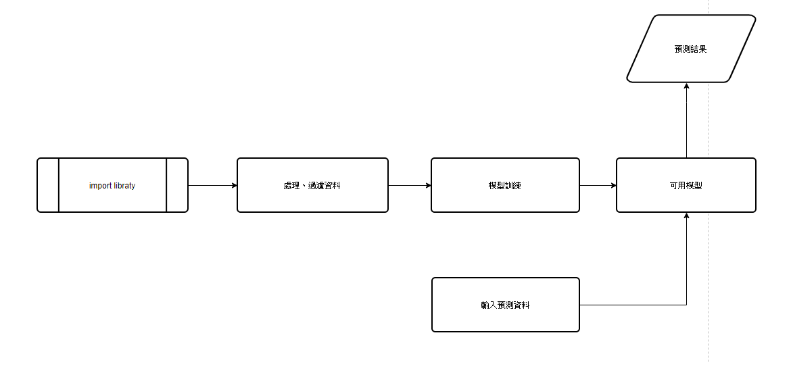

# Machine Learning LAB 1    房價預測
## 作法說明
1. 匯入全部所需要之套件   ` import numpy as np 
import pandas as pd 
import matplotlib.pyplot as plt 
import seaborn as sns
import warnings
from scipy import stats
from scipy.stats import norm, skew
from sklearn.linear_model import ElasticNet, Lasso,  BayesianRidge, LassoLarsIC
from sklearn.ensemble import RandomForestRegressor,  GradientBoostingRegressor
from sklearn.kernel_ridge import KernelRidge
from sklearn.pipeline import make_pipeline
from sklearn.preprocessing import RobustScaler
from sklearn.base import BaseEstimator, TransformerMixin, RegressorMixin, clone
from sklearn.model_selection import KFold, cross_val_score, train_test_split
from sklearn.metrics import mean_squared_error
import xgboost as xgb
import lightgbm as lgb
 `
  
 
2. 先將所有資料做整理，確保不會有少數特殊資料影響到預測結果，同時也進行特徵資料的分析、移除不必要的label(如id)     
`pd.set_option('display.float_format', lambda x: '{:.3f}'.format(x))
train = pd.read_csv('train-v3.csv')
test = pd.read_csv('test-v3.csv')`
此段匯入所需要之data   
`
print("The train data size before dropping Id feature is : {} ".format(train.shape))
print("The test data size before dropping Id feature is : {} ".format(test.shape))
`
確認樣本數量     剩餘部分，即是做特徵提取，以及消除部分未知資料(如 出現NULL等等特殊數值)
 

3. 模型訓練    此處採用LASSO 、Elastic Net 、 Kernel Ridge 、 Gradient Boosting Regression，並且採用Averaging base models堆疊方法(stacking model)，可達到較佳的結果。

## 程式流程   

